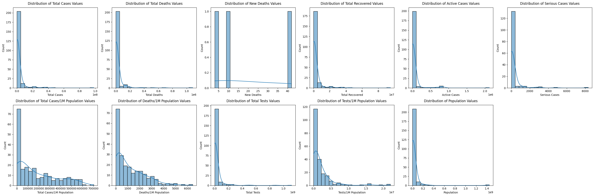

# Exploratory Data Analysis Report

## Introduction

The 2019–20 coronavirus pandemic is an ongoing global pandemic of coronavirus disease 2019 (COVID-19) caused by the severe acute respiratory syndrome coronavirus 2 (SARS-CoV-2). The virus first emerged in Wuhan, Hubei, China, in December 2019. On 11 March 2020, the World Health Organization declared the outbreak a pandemic. As of 11 March 2020, over 126,000 cases have been confirmed in more than 110 countries and territories, with major outbreaks in mainland China, Italy, South Korea, and Iran. More than 4,600 have died from the disease and 67,000 have recovered.

2019 Novel Coronavirus (2019-nCoV) is a virus (more specifically, a coronavirus) identified as the cause of an outbreak of respiratory illness first detected in Wuhan, China. Early on, many of the patients in the outbreak in Wuhan, China reportedly had some link to a large seafood and animal market, suggesting animal-to-person spread. However, a growing number of patients reportedly have not had exposure to animal markets, indicating person-to-person spread is occurring. At this time, it’s unclear how easily or sustainably this virus is spreading between people.

The dataset has information on the number of affected cases, deaths and recovery from 2019 novel coronavirus.

Dataset link : <https://www.kaggle.com/datasets/whenamancodes/covid-19-coronavirus-pandemic-dataset>

## Author & Data

Author: Pooja Dinani\
Date: 16/12/2023

## Overview of Dataset

* The dataset comprises 230 observations (rows) and 13 features (columns). The names of columns in dataset were replaced for better and easy understanding.
* The dataset includes a mix of numerical and categorical variables. The datatypes are as follow:
  1. Numeric (Int(64), float(64))
  2. Categorical (Object)
* The dataset has significant percentage of missing values. The percentage of missing values in each column is given below:
  1. '#'
  2. 'Country,\nOther '       0.000000
  3. 'Total\nCases '          0.000000
  4. 'Total\nDeaths '         2.173913
  5. 'New\nDeaths   '        98.695652
  6. 'Total\nRecovered  '     6.956522
  7. 'Active\nCases  '        6.521739
  8. 'Serious,\nCritical'    36.086957
  9. 'Tot Cases/\n1M pop '    0.869565
  10. 'Deaths/\n1M pop '       3.043478
  11. 'Total\nTests  '         6.956522
  12. 'Tests/\n1M pop  '       6.956522
  13. 'Population '            0.869565
* The dataset includes information of COVID-19 cases in 230 countries. 

## Renaming Columns

The columns in dataset are been renamed because they include unecesaary characters in their names which make calling column name difficult for analysis purposes. New column names are user-friendly and easier to work with as show below:

1. '#'
2. 'Country'
3. 'Total Cases'
4. 'Total Deaths'
5. 'New Deaths'
6. 'Total Recovered'
7. 'Active Cases'
8. 'Serious Cases'
9. 'Total Cases/1M Population'
10. 'Deaths/1M Population'
11. 'Total Tests'
12. 'Tests/1M Population'
13. 'Population'

## Data Reduction

In dataset there are 13 features/columns, among them one is '#' column or index column. It is not needed in data so it was dropped. Now dataset has 230 observations and 12 features. 

## Dataypes in Data

The data types for each column present in the dataset are as follows:

* 0   Country                    230 non-null    object
* 1   Total Cases                230 non-null    object
* 2   Total Deaths               225 non-null    object
* 3   New Deaths                 3 non-null      float64
* 4   Total Recovered            214 non-null    object
* 5   Active Cases               215 non-null    object
* 6   Serious Cases              147 non-null    object
* 7   Total Cases/1M Population  228 non-null    object
* 8   Deaths/1M Population       223 non-null    object
* 9   Total Tests                214 non-null    object
* 10  Tests/1M Population        214 non-null    object
* 11  Population                 228 non-null    object
dtypes: float64(1), object(11)

The country column includes strings 'country names' so it can be a of object datatypes. However, other all columns contain numeric values but they are stored in object datatypes. Columns with numeric values and object datatypes were converted to numeric dataypes so that numerical operations and analysis can be performed on a data. After conversion datatypes are as follow:

* 0   Country                    230 non-null    object 
* 1   Total Cases                230 non-null    int64  
* 2   Total Deaths               225 non-null    float64
* 3   New Deaths                 3 non-null      float64
* 4   Total Recovered            214 non-null    float64
* 5   Active Cases               215 non-null    float64
* 6   Serious Cases              147 non-null    float64
* 7   Total Cases/1M Population  228 non-null    float64
* 8   Deaths/1M Population       223 non-null    float64
* 9   Total Tests                214 non-null    float64
* 10  Tests/1M Population        214 non-null    float64
* 11  Population                 228 non-null    float64
dtypes: float64(10), int64(1), object(1)

## Duplicates in data

There are no any duplicates in data.

## Outliers in data

The dataset was checked for outliers using z-score method and count of outliers in each column is given below:

* Total Cases                  5
* Total Deaths                 4
* New Deaths                   0
* Total Recovered              5
* Active Cases                 7
* Serious Cases                3
* Total Cases/1M Population    0
* Deaths/1M Population         4
* Total Tests                  4
* Tests/1M Population          7
* Population                   2

The number of outliers in each column is relatively small so there is no need of removing outliers from data. Besides, removing outliers means exlcuding rows from analysis and exlcuding rows means excluding data of entire country from the data.

## Data Normalization

With the help of histograms, normalization of each column in data was checked and data was found to be right skewed. 

## Data Scaling

All columns of dataset are not in same range. It was known from `df.describe()` function and swarmplot. Without scaling analysis will not be effective.

## Correlation Between Variables

From heatmap, following observations were made:

* Total cases of COVID-19 has strong relationship with total tests, active cases, total recovered, and total deaths.
* Total deaths has strong relationship with total tests, serious cases.
* Total recovered has strong relationship with total tests.

## Hypothesis

Based on Exploratory Data Analysis following Hypotheses have been made:\
H0: The number of recoveries is equal to the total number of tests conducted.\
H1: The number of recoveries is less than the total number of tests conducted.\
H2: The number of recoveries is more than the total number of tests conducted.
